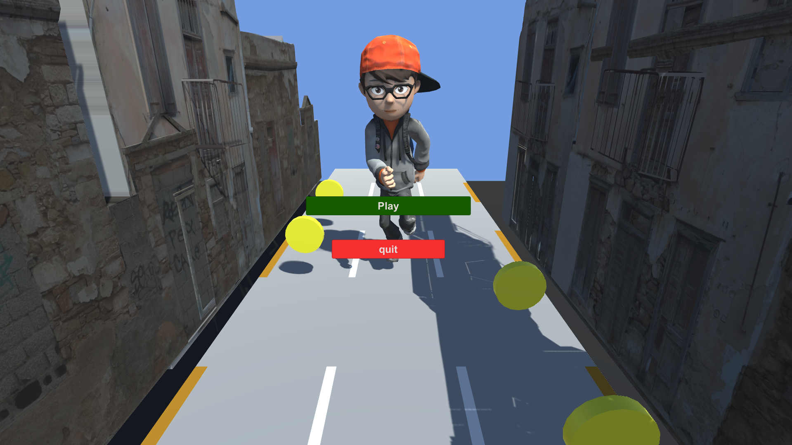
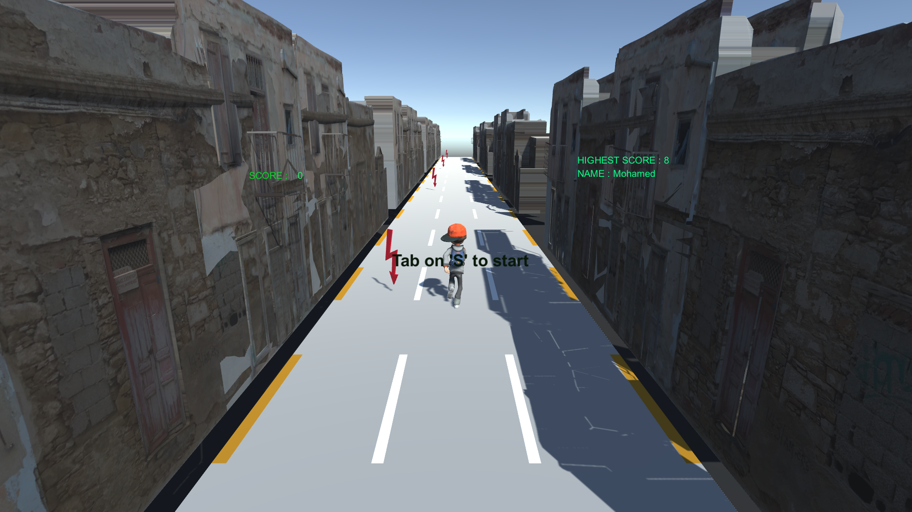
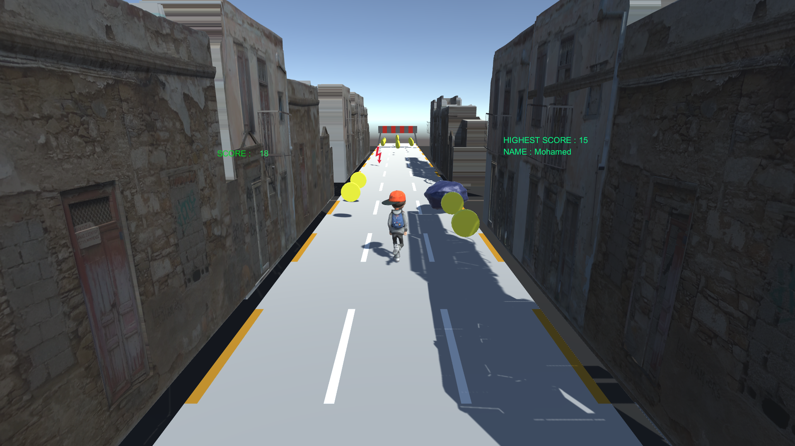

# Endless Runner

This project implements an endless runner game by following and extending on the ideas
in my college course to learn and create a complete endless runner game.

I have to say that while following the course was a really good learning experience,
the coding style in the lectures is just horrible. So .. better to follow the course in bed.

Since I'm still learning Unity and am not aware of Unity-specific best
practices, I'm not sure if I'm was doing the right thing here when trying to keep or 
save my sanity.
Also, some of the bugs - such as being able to jump multiple times, or being able to cancel the dying animation through jumping - are closely fixed i think.
Anyway, maybe someone does find this project helpful regardless of that.

## Implementation

Core ideas:

- Tiles are being spawned by a "virtual character" moving ahead of the player.
- The player is moving horizontally.
- Platforms are spawned from an object pool and everything behind the player is recycled immediately.

This project uses:

- Object pooling,
- The animation system with blended animations,
- Animation triggers (shooting magic, footstep sounds, ...),
- A bunch of particle systems,
- Overlapping colliders with initially deactivated physics for exploding wall bricks.
- Environment Design.
- Character Interaction.
- Action Gameplay.
- Customizable Characters and Equipments.

Here's some gameplay images:

## Additional Notes

- This game has been built using Unity, leveraging its powerful tools for creating a visually rich and engaging experience.
- Future updates or additional features can include multiplayer options, expanded storylines, or enhanced AI for NPCs.

We hope you enjoy the adventure! Feel free to provide feedback or suggestions for future improvements.
